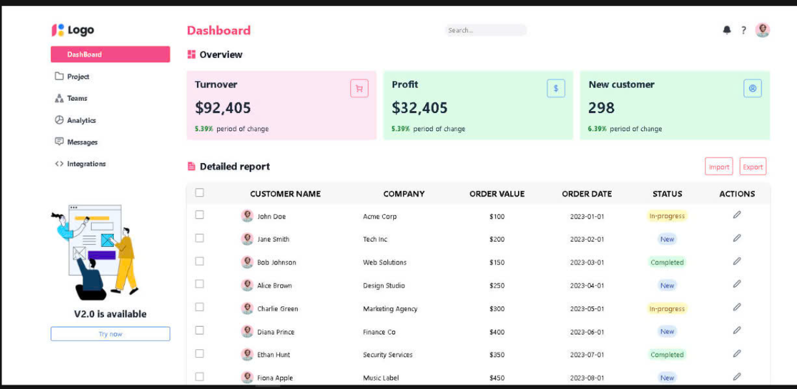
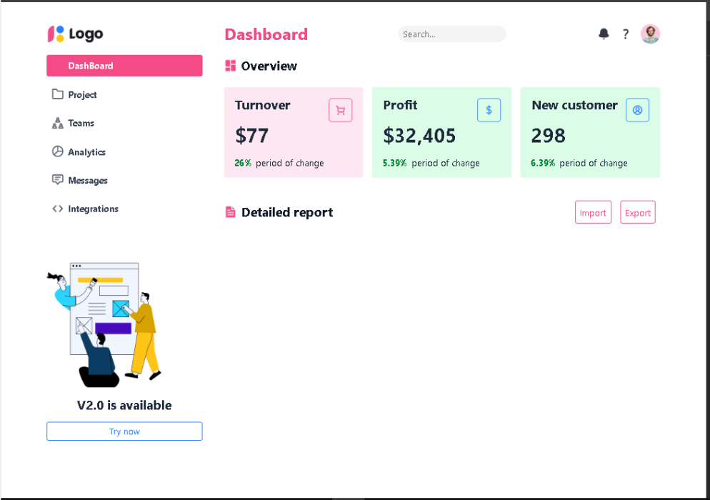
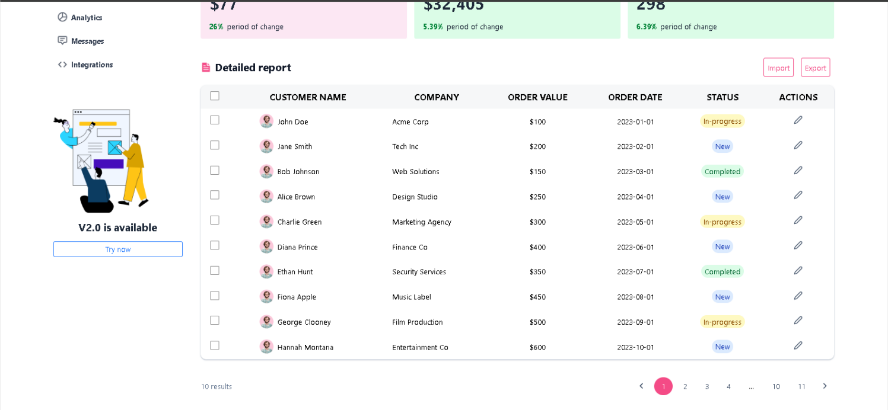
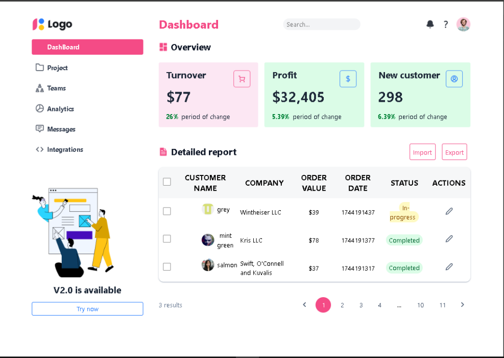
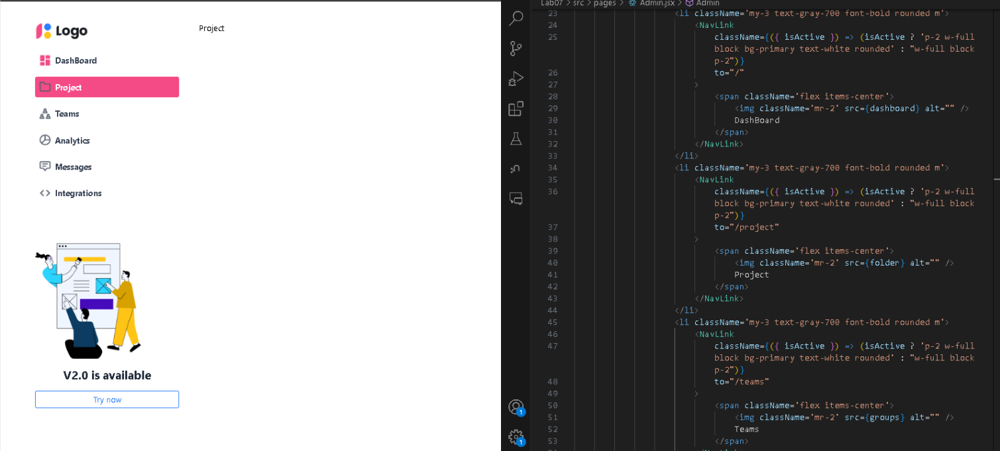
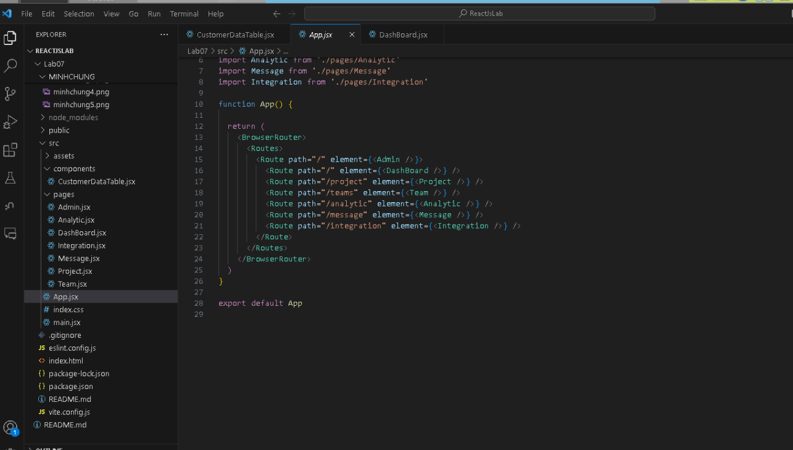
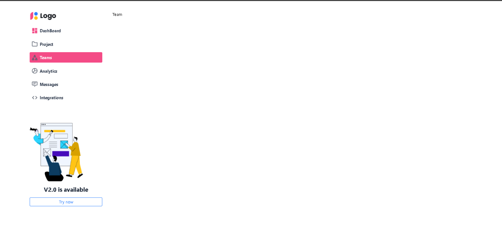

# BaiTapTuan02React/Lab07

### 1. Layout

### 2. API Overview

### 3. DataTable React JS

### 4. DataTable React JS - API

### 5. isActive-NavLink

### 6. ReactRouter

### 7. SPA - Single Page Application

### 8. Click Edit Modal

### 9. Moddal connect API

### 10. Add user

### 11. Css all admin app

